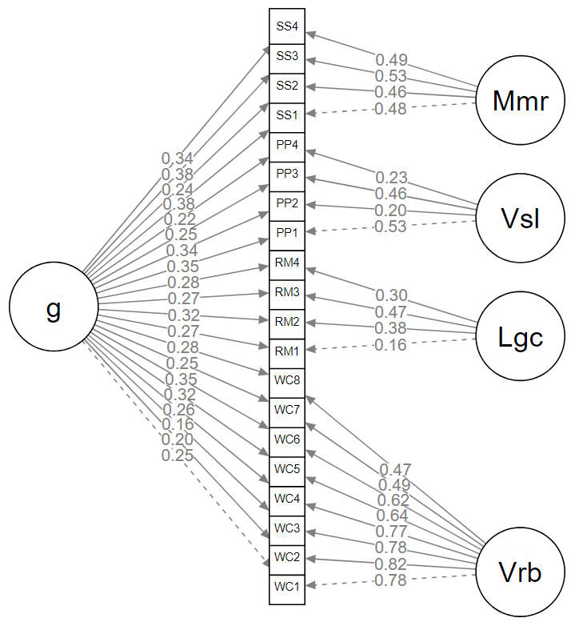

# Factor Analysis of - [Wordcel.org](https://wordcel.org)'s ***- [Rapid Battery](https://wordcel.org/rapid-battery/test)***

# G-loading: 0.70

**Goodness-of-fit metrics (n=451):**

- [✔] P(χ²): 0.13
- [✔] GFI: 0.964
- [✔] AGFI: 0.95
- [✔] NFI: 0.933
- [✔] NNFI/TLI: 0.989
- [✔] CFI: 0.992
- [✔] RMSEA: 0.017
- [✔] RMR: 0.029
- [✔] SRMR: 0.039
- [✔] RFI: 0.916
- [✔] IFI: 0.992
- [✔] PNFI: 0.737
================

Run `factor-analysis2.r` (`factor-analysis.r` was my previous attempt using a different model).

